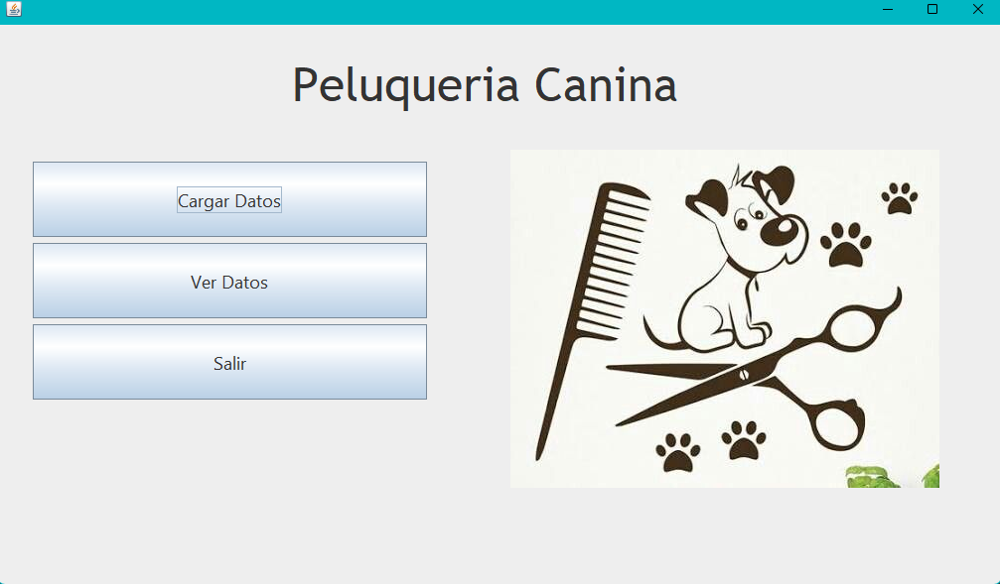
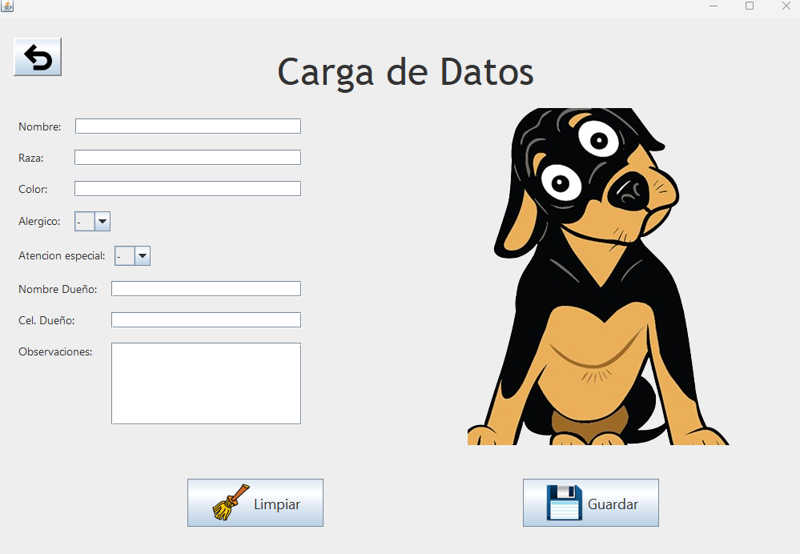
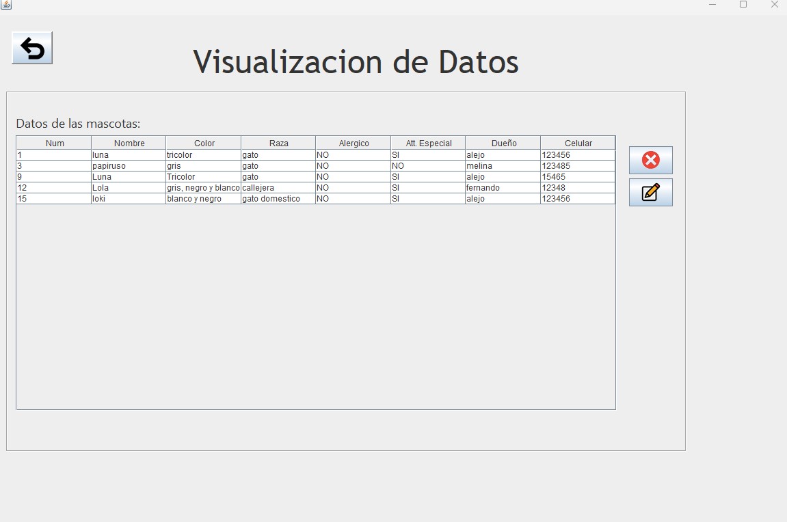

# 🐶 Peluquería Canina - Sistema de Gestión (Java Desktop)

Este es un sistema de gestión para una **peluquería canina**, desarrollado como aplicación de escritorio en **Java** con interfaz gráfica en **Swing** y persistencia de datos mediante **JPA / Hibernate**.

El proyecto permite:
- Registrar y administrar mascotas
- Guardar datos persistentes en base de datos
- Relacionar mascotas con sus dueños
- Eliminar, buscar y listar datos

## 📸 Capturas del sistema

Para agregar capturas:
1. Crea una carpeta `docs/` en la raíz
2. Súbelas a GitHub y referencia aquí

Ejemplos:

---

## 🛠 Tecnologías utilizadas

- ☕ **Java SE**
- 🖼️ **Swing** para la interfaz gráfica
- 🌐 **JPA / Hibernate** para persistencia
- 🗄️ **H2 o MySQL** para base de datos (configurable)
- 🧠 Arquitectura en capas (GUI — Lógica — Persistencia)
- 📍 **NetBeans IDE**

---

## 📁 Estructura del proyecto

Cada capa del sistema está separada para mantener el código organizado:
├── src/main/java
│ ├── igu/ # Interfaz gráfica
│ ├── logica/ # Lógica de negocio
│ ├── persistencia/ # Clases de persistencia / JPA
│ └── entidades/ # Entidades JPA
└── docs/ # Capturas, documentación visual
